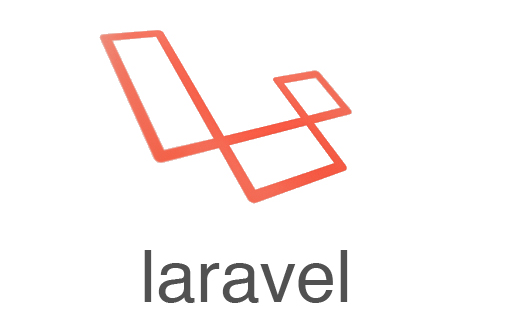
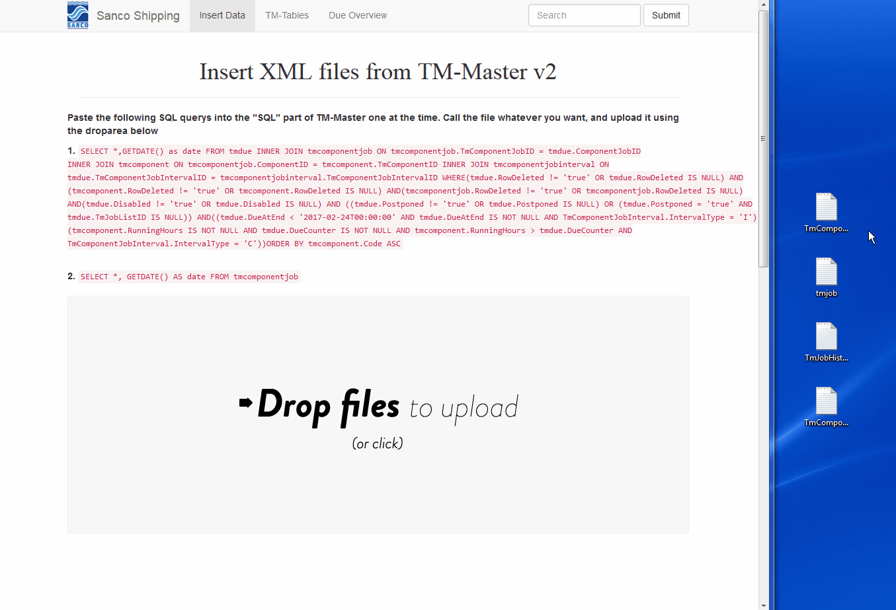

# Archive_DueOverview_SancoShipping from 2014
### An old project i made for my employer which helped keep track of overdue jobs on their vessels.

This software, known as DueOverview from now on, is a web application built with PHP and Javascript.

It uses bootstrap in the front, and laravel in the back. 

Also worth noting, it heavily relies on dropzonejs for drag'nDrop, and HighCharts for the fancy graphs. 

### start
1. DueOverview would generate an SQL string that the user would copy into a field in the maintenance software.

2. The maintenance software would then give you an xml file with all the data this software needed.

3. The user would then proceed to upload the xml files imply by draging the files into.

4. DueOverview would store all the information in its mySql database.

5. User would go to the overview page and see the statistics. 

